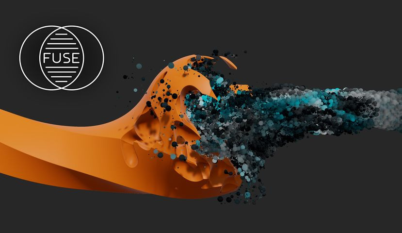

This has been a long time coming!

We've hoped to have this one out earlier, but finally, we can release it into your caring hands: The best vvvv gamma ever (so far). With tons of bug fixes, improvements, and new features. And without further ado, you can divvvve right into it:


__[Download vvvv gamma 2021.4.7](http://visualprogramming.net/#Download|)__

[Get started](https://thegraybook.vvvv.org/reference/getting-started/overview.html)  
[Buy a license](https://store.vvvv.org)

__Bugfix releases__
* 2021.4.7 on February 26, 2022
* 2021.4.6 on January 31, 2022
* 2021.4.5 on January 18, 2022
* 2021.4.4 on January 12, 2022
* 2021.4.3 on December 22, 2021
* 2021.4.2 on December 7, 2021
* 2021.4.1 on December 6, 2021

[Full Change Log](https://thegraybook.vvvv.org/changelog/2021.4.html)


Here is to give you an overview of the most notable changes:

## UI/UX
### Improved patching performance
Part of the magic of vvvv gamma is, that it has the advantages of a visual live programming environment combined with the advantages of a compiled language. Getting those two to work together smoothly is one hard nut to crack. In this release, we were able to improve the patching performance with larger projects by introducing a new compilation and hotswap strategy. For details, see [this discussion](https://discourse.vvvv.org/t/ui-performance-issues/18638/).

### Hamburger menu
The new hamburger menu in the top right corner of the editor gives you quick access to [Settings](https://thegraybook.vvvv.org/reference/hde/settings.html), [Themes](https://thegraybook.vvvv.org/reference/hde/settings.html), Licensing information and the About page.

### Editor extensions
Are you missing a feature in the vvvv editor and don't want to wait for us to build it? Editor extensions allow you to essentially build plugins for vvvv itself. Available examples are a desktop color picker, a TUIO simulator and monitor and a Spout monitor. [Read more](https://thegraybook.vvvv.org/reference/hde/extensions.html). 

But the best thing about extensions is, that they are just patches. So it takes just a few clicks to create your own. [Read more](https://thegraybook.vvvv.org/reference/extending/editor-extensions.html).

## Libraries
### Updates to Stride 3d rendering
* TextureFX: We added a vast collection of easy to use nodes for applying visual effects to textures
* We added Pipet and MeshSplit nodes and fully reworked the Texture- and Buffer-creation nodes
* Latest Stride comes with two new PostFX: Fog and Outline
* We added a ShaderFX node factory that allows to easily write composable shader snippets
* Materials can now be extended with custom shaders

### FUSE - visual gpu patching
This release paves the way for the almighty new [FUSE](https://www.thefuselab.io) library, developed by [dottore](https://vvvv.org/users/dottore), [everyoneishappy](https://vvvv.org/users/everyoneishappy) and [texone](https://vvvv.org/users/texone). It allows you to use your GPU for things that typically require writing shaders. FUSE gives you access to procedural noise, signed distance field rendering, customizable particle systems, vector fields, fluid simulations and more, without having to write shader programs! Watch this video to see [how to get started with FUSE](https://youtu.be/25sk7_NaEgM).

### Video input and playback
We added stable support for the effortless playback of a wide range of video formats for both Skia and Stride. In addition, we added ImagePlayer nodes for the playback of image sequences. [Read more](https://thegraybook.vvvv.org/reference/best-practice/video-playback.html).

The ImagePlayers can also easily be synced over the network. [Read more](https://thegraybook.vvvv.org/reference/best-practice/video-synchronization.html).

### Updates to Skia 2d rendering
* 2d rendering is now fully GPU accelerated, which greatly improves performance in many scenarios
* SkiaRenderer and SkiaTexture nodes now also work on AMD GPUs

## Language
* The "This" node can now be used in constructors as well as in generic patches. For details, see [this dicussion](https://github.com/vvvv/VL-Language/issues/21)
* You can now use explicit type parameters. For details, see [this discussion](https://github.com/vvvv/VL-Language/issues/39)
* You can now patch a stateful region with BorderControlPoints! See the "ManageProcess" node for an example

---

And these were only the highlights. For all the details, please see [the changelog](https://thegraybook.vvvv.org/changelog/2021.4.html).

## Licensing
The release of a new version is always a good moment to make sure you still have a valid license for commercial use. To check, log into your account here on vvvv.org and then view [your vvvv gamma licenses](https://store.vvvv.org/licenses).

In case, you simply [buy a license](https://store.vvvv.org/) the moment you start working on a commercial project. Don't forget that we also have monthly options!

---

What next? Expect the occasional 2021.4.x bug-fix release while we're starting work on the 2021.5 branch as per the updated [roadmap](https://thegraybook.vvvv.org/roadmap/planned.html).

Good patch!